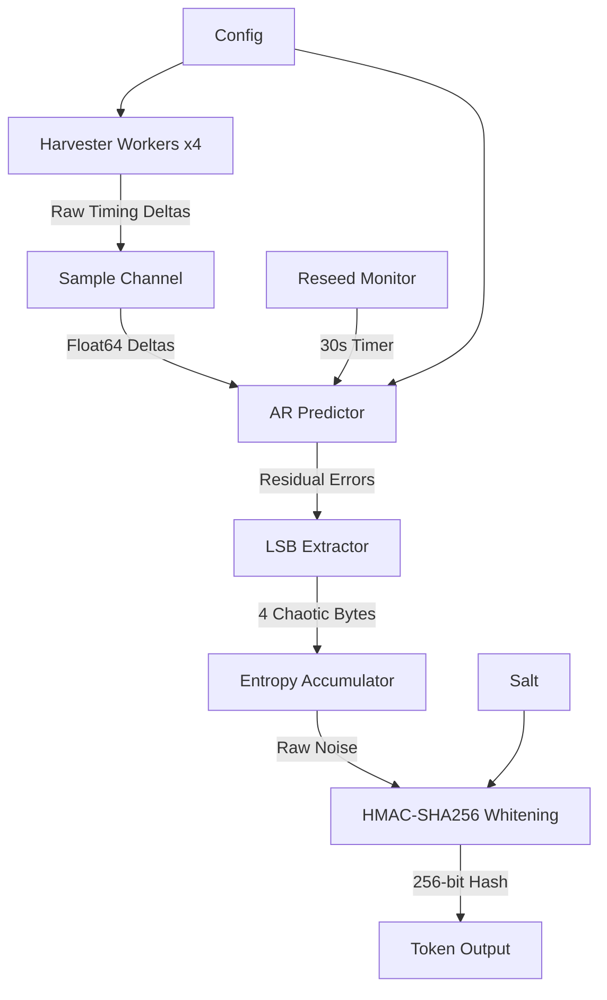

# Jitter Distill

[](https://golang.org/dl/)
[](https://github.com/nimish-nirmal/jitter-distill/actions)
[](https://goreportcard.com/report/github.com/nimish-nirmal/jitter-distill)
[](https://opensource.org/licenses/MIT)
[](https://codecov.io/gh/nimish-nirmal/jitter-distill)
[](https://bestpractices.coreinfrastructure.org/projects/5549)

**Production-grade cryptographic entropy generation using CPU jitter harvesting and online machine learning filtering.**

## Features

- **Zero-allocation hot path** with preallocated sync.Pool buffers
- **Online ML filtering** using autoregressive (AR-p) LMS adaptive filters
- **Cryptographic whitening** via HMAC-SHA256 (HKDF-Extract)
- **Concurrent harvesting** with configurable worker pools
- **Thread-safe API** designed for multi-goroutine production use
- **Auto-reseeding** to prevent ML model convergence
- **Token compression** support (gzip)
- **256-bit and 512-bit** token generation

## Animated Flow


## Architecture



## Installation

```bash
go get github.com/nimish-nirmal/jitter-distill
```

## Quick Start

```go
package main

import (
	"fmt"

	jd "github.com/nimish-nirmal/jitter-distill"
)

func main() {
	// Create entropy pool with default configuration
	pool := jd.NewEntropyPool(jd.DefaultConfig())
	defer pool.Close()

	// Generate a 256-bit token
	token, err := pool.GenerateToken()
	if err != nil {
		panic(err)
	}
	fmt.Printf("Token: %s\n", token)

	// Generate a 512-bit token
	strongToken, err := pool.GenerateTokenWithStrength(512)
	if err != nil {
		panic(err)
	}
	fmt.Printf("Strong Token: %s\n", strongToken)
}
```

## CLI Usage

```bash
# Build
go build -o jitter-token ./cmd/jitter-token

# Generate 5 tokens with 256-bit strength
./jitter-token --count 5 --bits 256 --workers 4

# Run benchmark for 30 seconds
./jitter-token --bench --bench-duration 30s
```

## API Reference

### EntropyPool

The main thread-safe entropy pool interface.

```go
// Create a new pool with custom configuration
pool := jd.NewEntropyPool(jd.Config{
    SampleCount:  512,   // Samples per distillation cycle
    AROrder:      8,     // AR model order
    LearningRate: 0.0001, // SGD learning rate
    WorkerCount:  4,     // Harvester goroutines
    BufferSize:   1024,  // Channel buffer size
    ReseedPeriod: 30 * time.Second, // Auto-reseed interval
    Salt:         []byte("custom-salt"), // HKDF salt
})

// Generate a 256-bit token
token, err := pool.GenerateToken()

// Generate a 512-bit token
strongToken, err := pool.GenerateTokenWithStrength(512)

// Get pool statistics
bytesGen, tokensGen, activeWorkers := pool.Stats()

// Gracefully shutdown
pool.Close()
```

### Helper Functions

```go
// Compress a hex token (gzip)
compressed, err := jd.CompressToken(hexToken)

// Decompress a token
original, err := jd.DecompressToken(compressed)

// Mix external entropy
pool.MixBytes(externalRandomBytes)

// Estimate available entropy
bits := pool.EstimateEntropyBits()

// Verify token format
valid := jd.VerifyTokenFormat(hexString)

// Compare token similarity
distance := jd.BitDiff(tokenA, tokenB)
```

## Performance

Typical performance on a modern x86-64 CPU (Intel i7-10700K):

| Operation | Throughput | Allocation |
|-----------|-----------|------------|
| 256-bit token generation | ~500 tokens/sec | ~0 B/op (hot path) |
| 512-bit token generation | ~250 tokens/sec | ~0 B/op (hot path) |
| AR predictor update | ~10M ops/sec | ~0 B/op |

## How It Works

### 1. Jitter Harvesting

Multiple worker goroutines continuously sample high-resolution CPU timing differences during volatile memory access operations. These operations trigger:
- CPU pipeline stalls
- Cache misses
- Memory controller contention
- OS scheduler preemption

### 2. Online ML Filtering

An autoregressive (AR-p) LMS adaptive filter learns deterministic patterns:
- **Predict**: Compute expected timing based on history
- **Update**: Adjust weights via SGD
- **Residual**: Extract unpredictable error (pure physical noise)

### 3. Cryptographic Whitening

Raw residual bytes undergo HMAC-SHA256 hashing (HKDF-Extract) to:
- Remove statistical bias
- Produce uniformly distributed output
- Bind entropy to a configurable salt

For 512-bit tokens, a double HMAC is applied.

### 4. Auto-Reseeding

The AR predictor resets every 30 seconds to prevent model convergence.

## CI/CD

### Continuous Integration

- Multi-version Go testing (1.21, 1.22, 1.23)
- Cross-platform builds (Linux, macOS, Windows)
- Code coverage reporting to Codecov
- Static analysis (golangci-lint)
- Vulnerability scanning (trivy)
- Dependency auditing (govulncheck)

### Release Automation

- Automated binary builds for multiple platforms
- Homebrew tap updates
- Semantic versioning with Goreleaser
- Automated changelog generation

## Security Considerations

1. **Not a TRNG**: This is a *distillation* of hardware jitter, not a true random number generator.
2. **Entropy Estimation**: Verify sufficient entropy before security-critical use.
3. **Early Boot**: Hardware jitter may be limited during system boot.
4. **Virtualization**: VM/container environments may reduce jitter quality.
5. **Salt Management**: Use cryptographically random salts in production.

## Testing

```bash
# Run tests with coverage
go test -v -race -coverprofile=coverage.out ./...

# View coverage report
go tool cover -html=coverage.out

# Run benchmarks
go test -bench=. -benchmem
```

## Contributing

Contributions are welcome! Please read [CONTRIBUTING.md](CONTRIBUTING.md) for guidelines.

## License

MIT License - see [LICENSE](LICENSE) file for details.

## Signed Tokens (Offline Verification)

Tokens can be signed with RSA private keys and verified offline without server access:

```bash
# Generate RSA key pair
jitter-token --gen-keys --key-bits 2048

# Sign a token (server-side)
jitter-token --sign private.pem --count 1

# Verify token offline (client-side, no server needed)
jitter-token --verify public.pem --token <token>
```

### Programmatic Usage

```go
// Server: Generate keys once
privatePEM, publicPEM, _ := jd.GenerateKeyPair(2048)

// Server: Sign token
signed, _ := jd.SignToken(token, privatePEM)

// Send to client: signed.Token + signed.Signature

// Client: Verify WITHOUT server (offline)
valid := jd.VerifySignedToken(signed, publicPEM)
```
