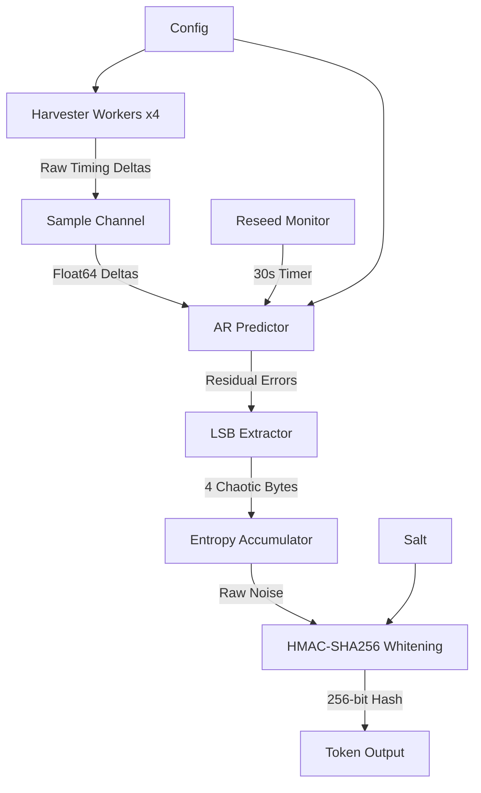
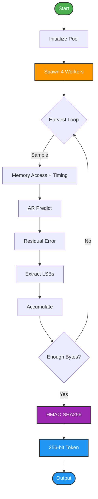

# Jitter Distill

[](https://golang.org/dl/)
[](https://github.com/nimish-nirmal/jitter-distill/actions)
[](https://goreportcard.com/report/github.com/nimish-nirmal/jitter-distill)
[](https://opensource.org/licenses/MIT)
[](https://codecov.io/gh/nimish-nirmal/jitter-distill)

**An ultra-fast, zero-allocation Go library that generates uncrackable cryptographic tokens by distilling CPU and memory timing jitter through an online autoregressive machine-learning filter and HKDF-SHA256 whitening.**

## Why Jitter Distill?

Traditional random generators may leak state when running inside VMs, containers, or state-cloned deployments. Jitter Distill instead:

- **Harvests physical hardware jitter** - CPU instruction cycles, cache misses, memory-controller contention, OS-scheduler preemption.
- **Filters out deterministic patterns** - an online Autoregressive (AR-p) LMS adaptive model predicts the expected execution time, so only the *unpredictable residual* is kept.
- **Whitens the noise** - the chaotic residual bits are passed through HMAC-SHA256 (HKDF-Extract) to remove bias and yield uniformly distributed, cryptographically secure output.

Because it binds entropy to real hardware behavior, it is resilient even when a VM image is cloned and resumed.

## Features

- **Zero-allocation hot path** via preallocated buffers (no GC pressure)
- **Online ML filtering** with an AR-p LMS adaptive filter (Stochastic Gradient Descent)
- **Cryptographic whitening** through HMAC-SHA256 (HKDF-Extract phase)
- **Concurrent harvesting** with a configurable background worker pool
- **Thread-safe** API safe for concurrent use by many goroutines
- **Auto-reseeding** every 30s to prevent ML-model convergence
- **256-bit and 512-bit** token generation
- **RSA signing** for offline token verification (no server needed on the client)
- **gzip compression** helpers for storing/transmitting tokens

---

## Table of Contents

- [Installation](#installation)
- [Quick Start](#quick-start)
- [CLI Usage](#cli-usage)
- [API Reference](#api-reference)
- [Offline Token Verification](#offline-token-verification)
- [Architecture](#architecture)
- [How It Works](#how-it-works)
- [Performance](#performance)
- [Testing](#testing)
- [CI/CD](#cicd)
- [Security Considerations](#security-considerations)
- [Contributing](#contributing)
- [License](#license)

---

## Installation

Requires **Go 1.24+**.

```bash
go get github.com/nimish-nirmal/jitter-distill
```

Then import it:

```go
import jd "github.com/nimish-nirmal/jitter-distill"
```

---

## Quick Start

Generating your first cryptographic token is just a few lines:

```go
package main

import (
	"fmt"

	jd "github.com/nimish-nirmal/jitter-distill"
)

func main() {
	// Create an entropy pool with safe defaults.
	pool := jd.NewEntropyPool(jd.DefaultConfig())
	defer pool.Close()

	// Generate a 256-bit token (64 hex chars) - blocking, thread-safe.
	token, err := pool.GenerateToken()
	if err != nil {
		panic(err)
	}
	fmt.Println("256-bit token:", token)

	// Generate a 512-bit token (128 hex chars) for stronger guarantees.
	strong, err := pool.GenerateTokenWithStrength(512)
	if err != nil {
		panic(err)
	}
	fmt.Println("512-bit token:", strong)
}
```

**Tip:** workers start harvesting jitter in the background immediately after `NewEntropyPool`. There is no need to wait before calling `GenerateToken`.

---

## CLI Usage

The repository ships a ready-to-use command-line tool.

### Build it

```bash
go build -o jitter-token ./cmd/jitter-token
```

### Generate tokens

```bash
# Generate 3 tokens (256-bit) using 4 worker goroutines
./jitter-token --count 3 --bits 256 --workers 4

# Generate a single 512-bit token
./jitter-token --count 1 --bits 512
```

### Benchmark mode

```bash
# Measure tokens/sec over 30 seconds
./jitter-token --bench --bench-duration 30s
```

### Generate RSA signing keys

```bash
./jitter-token --gen-keys --key-bits 2048
# Creates: private.pem (keep SECRET) and public.pem (share freely)
```

### Sign a token (server-side)

```bash
./jitter-token --sign private.pem --count 1
```

### Verify a token (offline, client-side)

```bash
./jitter-token --verify public.pem --token <token>
```

---

## API Reference

### EntropyPool - the core thread-safe object

Create a pool with the defaults or a fully custom configuration:

```go
// Custom configuration
pool := jd.NewEntropyPool(jd.Config{
	SampleCount:  512,               // jitter samples per distillation cycle
	AROrder:      8,                 // autoregressive model order
	LearningRate: 0.0001,            // SGD learning rate
	WorkerCount:  4,                 // background harvesting goroutines
	BufferSize:   1024,              // internal channel buffer size
	PoolSize:     64,                // preallocated buffer pool size
	ReseedPeriod: 30 * time.Second,  // auto-reseed interval
	Salt:         []byte("my-salt"), // HKDF salt
})

// Public methods
token, err := pool.GenerateToken()                 // 256-bit hex token
strong, err := pool.GenerateTokenWithStrength(512) // 512-bit hex token
bytesGen, tokensGen, workers := pool.Stats()       // live statistics
pool.Reseed()                                      // force a model reset
pool.Close()                                       // graceful shutdown
```
### Package-level functions

```go
// Default configuration
cfg := jd.DefaultConfig()

// gzip compression helpers
compressed, err := jd.CompressToken(hexToken)
original, err := jd.DecompressToken(compressed)

// Mix external entropy bytes
jd.MixBytes(someRandomBytes)

// Rough entropy estimate from a history slice
bits := jd.EstimateEntropyBits(historySlice)

// Token format validation (64 or 128 hex chars)
ok := jd.VerifyTokenFormat(token)

// Hamming distance between two tokens
distance := jd.BitDiff(tokenA, tokenB)
```

### The AR predictor (advanced)

```go
// Build your own autoregressive filter
model := jd.NewARPredictor(8, 0.0001)

residual := model.Update(actualExecutionTime) // returns unpredictable error
pred := model.Predict()                       // expected next value
model.Reset()                                 // clear weights & history
```

---

## Offline Token Verification

Jitter Distill tokens can be **digitally signed** with an RSA private key on the server, then **verified offline on any client** that only holds the public key. This is ideal for license keys, API tokens, and air-gapped environments.

```text
   SERVER (has private.pem)                    CLIENT (has ONLY public.pem)
   ------------------------                    ---------------------------------
   1. Generate entropy token
   2. Sign with private key
   3. Send { token, signature }  ------->   4. Verify with public key
                                               5. Done - no server call needed!
```

### Programmatic flow

```go
// ---------- SERVER ----------
privatePEM, publicPEM, err := jd.GenerateKeyPair(2048) // or 4096

token, _ := pool.GenerateToken()
signed, err := jd.SignToken(token, privatePEM)
// Ship to the client: signed.Token + hex(signed.Signature)

// ---------- CLIENT (no server access) ----------
publicPEM, _ := os.ReadFile("public.pem")
signed := &jd.SignedToken{
	Token:     receivedToken,
	Signature: receivedSignatureBytes,
}
if jd.VerifySignedToken(signed, publicPEM) {
	fmt.Println("Token is valid.")
} else {
	fmt.Println("Token is invalid or tampered.")
}
```

### Signing API

| Function | Description |
|----------|-------------|
| `jd.GenerateKeyPair(bits int)` | Generate an RSA key pair |
| `jd.SignToken(token, privateKeyPEM)` | Sign a token with the private key |
| `jd.VerifySignedToken(signed, publicKeyPEM)` | Verify a token offline |

See [OFFLINE_VERIFICATION_GUIDE.md](./OFFLINE_VERIFICATION_GUIDE.md) for a full walkthrough.

---

## Architecture



### Animated data flow



More diagrams live in [docs/diagrams/](docs/diagrams/).
---

## How It Works

### 1. Jitter harvesting

Background worker goroutines continuously sample high-resolution CPU timing differences (`time.Now().UnixNano()`) around volatile memory-access loops. The intentional memory churn forces:

- CPU pipeline stalls
- L1/L2/L3 cache misses
- Memory-controller contention
- OS-scheduler preemption

Each of these injects hard-to-predict, hardware-level timing variation.

### 2. Online machine-learning residual filtering

An autoregressive (AR-p) LMS adaptive filter models the deterministic component of execution time:

```text
predict = w0*hist[0] + w1*hist[1] + ...
error    = actual_time - predict          // the unpredictable residual
w_i     += learningRate * error * hist[i] // SGD weight update
```

By continuously adapting its weights to the expected behavior, the model keeps only the physical noise in the residual. The least-significant bits of that residual represent the true entropy source.

### 3. Cryptographic whitening

Raw residual bytes are fed into an HMAC-SHA256 sponge (the HKDF-Extract phase), which:

- removes any residual statistical bias
- produces a uniformly distributed 256-bit output
- binds the result to a configurable salt

For 512-bit output, a second independent HMAC is applied.

### 4. Auto-reseeding

The AR predictor is automatically reset every 30 seconds (configurable via `Config.ReseedPeriod`) so the model never fully converges and entropy stays fresh.

---

## Performance

Typical figures on a modern x86-64 CPU (e.g., Intel i7-10700K):

| Operation | Throughput | Hot-path allocation |
|-----------|-----------|---------------------|
| 256-bit token generation | ~500 tokens/sec | ~0 B/op |
| 512-bit token generation | ~250 tokens/sec | ~0 B/op |
| AR predictor update | ~10M ops/sec | ~0 B/op |

> Exact numbers depend on your CPU, clock resolution, and OS. Run the benchmarks on your target hardware.

---

## Testing

The project ships a unit-test suite and benchmarks:

```bash
# Run all tests with the race detector and coverage
make test

# Or manually:
go test -v -race -coverprofile=coverage.out ./...

# View the coverage report
make coverage
# or: go tool cover -html=coverage.out

# Run benchmarks
make bench
# or: go test -bench=. -benchmem

# Static analysis
make vet
```

All common tasks are wired into the [Makefile](Makefile).

---

## CI/CD

### Continuous Integration

GitHub Actions runs on every push/PR:

- Go versions 1.24, 1.25
- Platforms: Linux, macOS, Windows
- Race-enabled tests with coverage to Codecov
- Static analysis via `golangci-lint`
- Vulnerability scanning via `trivy` and `govulncheck`
- Dependency freshness via Dependabot

### Release Automation

Pushing a `vX.Y.Z` tag triggers [GoReleaser](.goreleaser.yml), which:

- builds binaries for Linux, macOS, and Windows (amd64 / arm64 / arm)
- attaches checksums and the changelog
- publishes a GitHub Release

---

## Security Considerations

1. **Not a TRNG** - this distills and whitens hardware jitter; it does not create entropy from nothing. Seed it from a reliable OS RNG at startup for best results.
2. **Verify entropy** - call `jd.EstimateEntropyBits(...)` to confirm you have enough before security-critical use (at least 128 bits recommended).
3. **Early boot** - hardware jitter may be low right after boot; let the pool warm up.
4. **Virtualization** - VMs and containers can reduce jitter quality; benchmark in your target environment.
5. **Salt / keys** - use cryptographically random salts, and keep private signing keys on the server only (never commit them).

---

## Contributing

Contributions are welcome - see [CONTRIBUTING.md](CONTRIBUTING.md). Be sure to run `make test` and `make lint` before opening a pull request.

## License

Released under the [MIT License](LICENSE). Copyright (c) 2026 **Nimish Nirmal**.
EOF
EOF