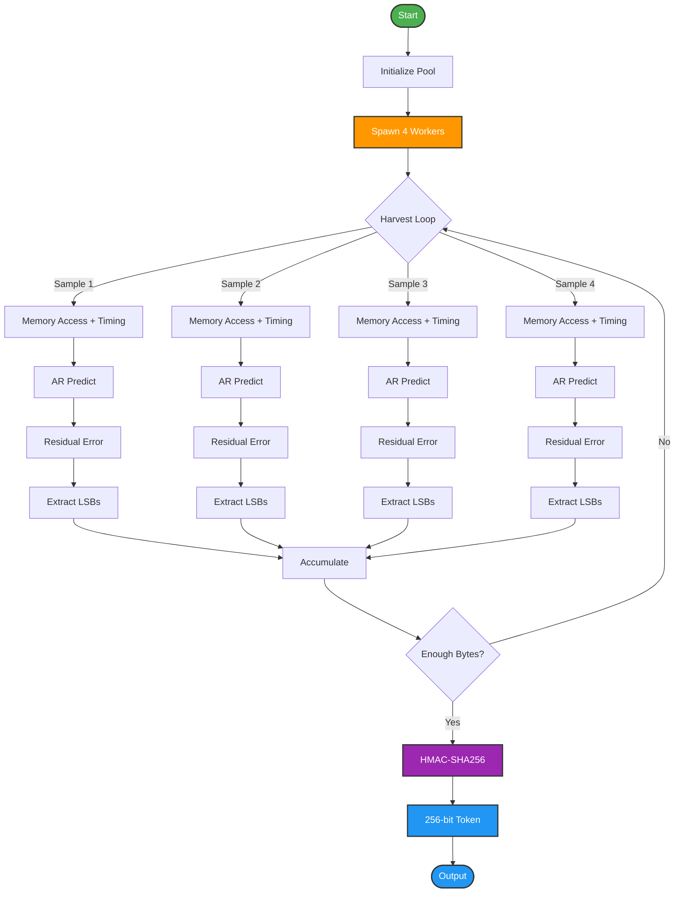
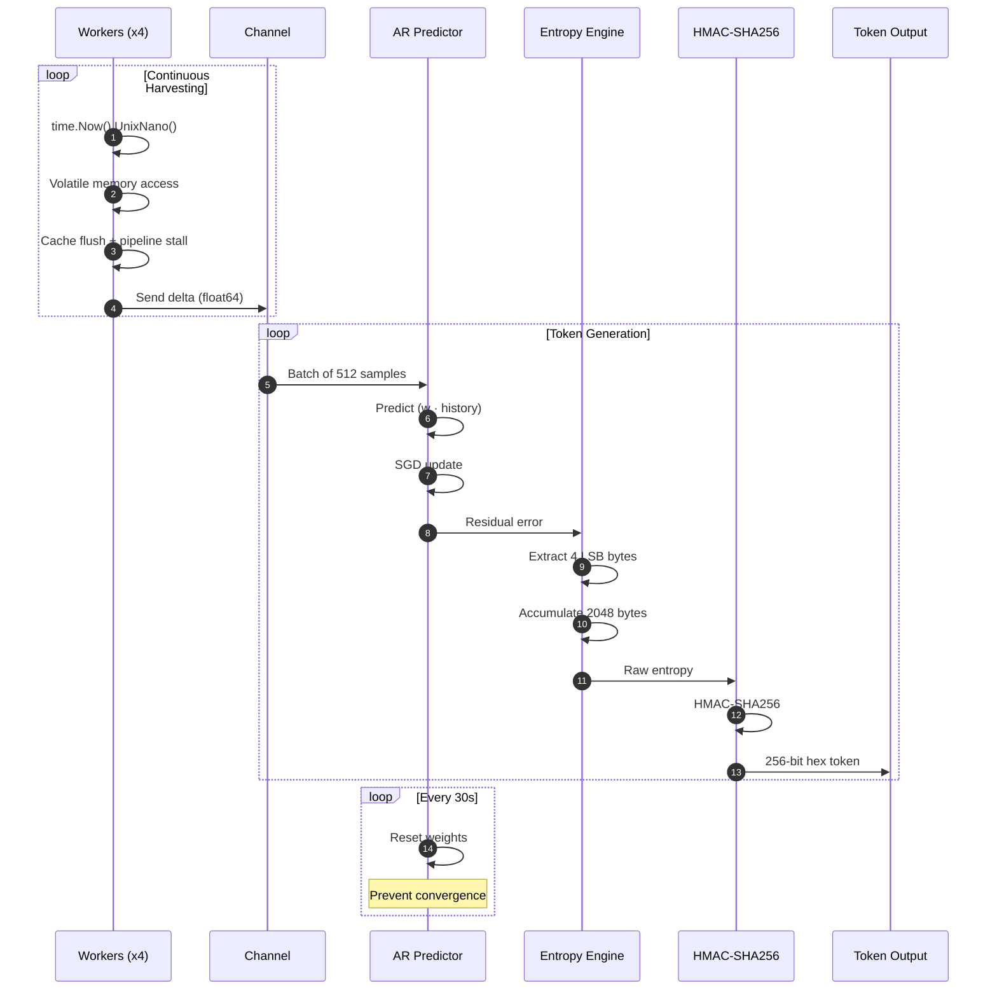
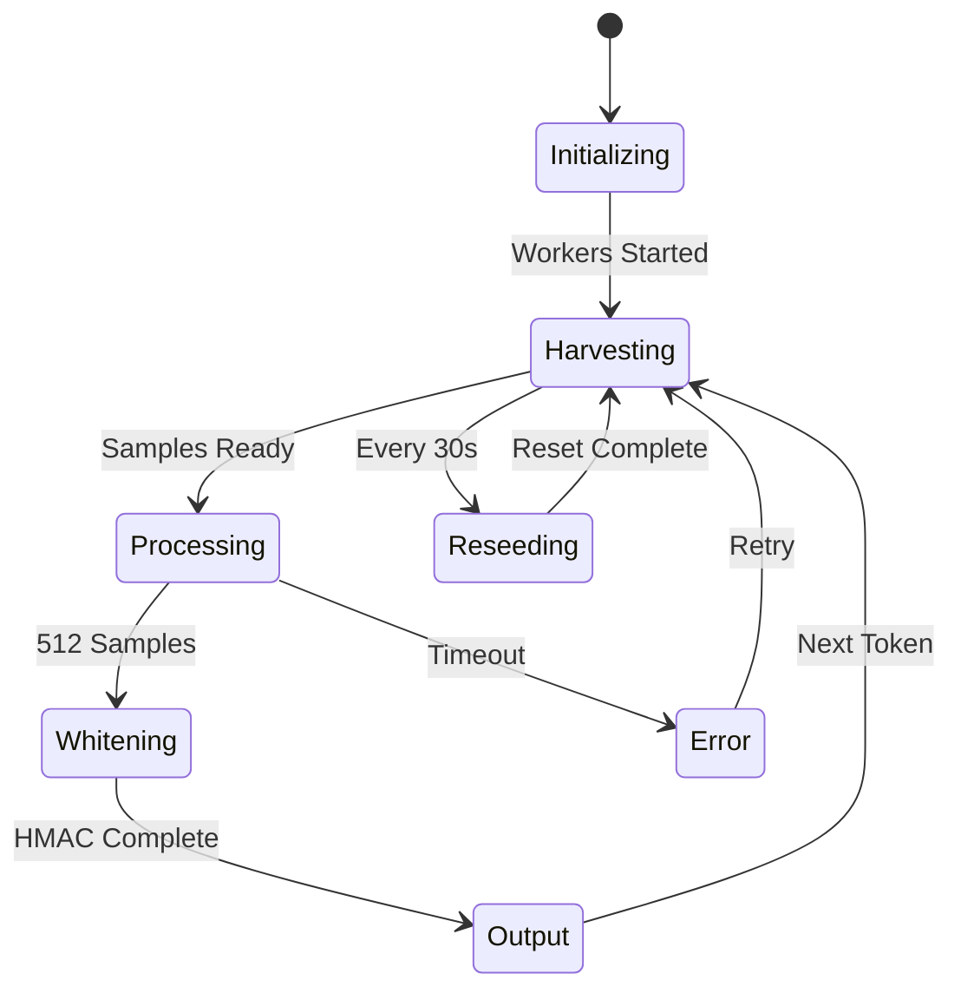

# Animated Flow Visualization

## Dynamic Pipeline Animation

```mermaid
flowchart TD
    Start([Start]) --> Init[Initialize Pool]
    Init --> Workers[Spawn 4 Workers]
    Workers --> Loop{Harvest Loop}
    
    Loop -->|Sample 1| H1[Memory Access + Timing]
    H1 --> P1[AR Predict]
    P1 --> R1[Residual Error]
    R1 --> E1[Extract LSBs]
    E1 --> Acc[Accumulate]
    
    Loop -->|Sample 2| H2[Memory Access + Timing]
    H2 --> P2[AR Predict]
    P2 --> R2[Residual Error]
    R2 --> E2[Extract LSBs]
    E2 --> Acc
    
    Loop -->|Sample 3| H3[Memory Access + Timing]
    H3 --> P3[AR Predict]
    P3 --> R3[Residual Error]
    R3 --> E3[Extract LSBs]
    E3 --> Acc
    
    Loop -->|Sample 4| H4[Memory Access + Timing]
    H4 --> P4[AR Predict]
    P4 --> R4[Residual Error]
    R4 --> E4[Extract LSBs]
    E4 --> Acc
    
    Acc --> Check{Enough Bytes?}
    Check -->|No| Loop
    Check -->|Yes| Whitening[HMAC-SHA256]
    Whitening --> Token[256-bit Token]
    Token --> Output([Output])
    
    %% Styling
    style Start fill:#4CAF50,stroke:#333,stroke-width:2px,color:#fff
    style Output fill:#2196F3,stroke:#333,stroke-width:2px,color:#fff
    style Workers fill:#FF9800,stroke:#333,stroke-width:2px,color:#fff
    style Whitening fill:#9C27B0,stroke:#333,stroke-width:2px,color:#fff
    style Token fill:#2196F3,stroke:#333,stroke-width:2px,color:#fff
```

## Real-time Data Flow

```mermaid
sequenceDiagram
    autonumber
    participant W as Workers (x4)
    participant C as Channel
    participant AR as AR Predictor
    participant E as Entropy Engine
    participant H as HMAC-SHA256
    participant T as Token Output

    loop Continuous Harvesting
        W->>W: time.Now().UnixNano()
        W->>W: Volatile memory access
        W->>W: Cache flush + pipeline stall
        W->>C: Send delta (float64)
    end

    loop Token Generation
        C->>AR: Batch of 512 samples
        AR->>AR: Predict (w · history)
        AR->>AR: SGD update
        AR->>E: Residual error
        E->>E: Extract 4 LSB bytes
        E->>E: Accumulate 2048 bytes
        E->>H: Raw entropy
        H->>H: HMAC-SHA256
        H->>T: 256-bit hex token
    end

    loop Every 30s
        AR->>AR: Reset weights
        Note over AR: Prevent convergence
    end
```

## State Machine

```mermaid
stateDiagram-v2
    [*] --> Initializing
    Initializing --> Harvesting: Workers Started
    Harvesting --> Processing: Samples Ready
    Processing --> Whitening: 512 Samples
    Whitening --> Output: HMAC Complete
    Output --> Harvesting: Next Token
    
    Harvesting --> Reseeding: Every 30s
    Reseeding --> Harvesting: Reset Complete
    
    Processing --> Error: Timeout
    Error --> Harvesting: Retry
```
