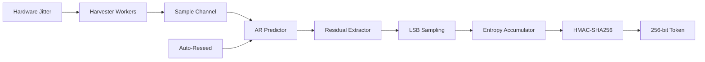
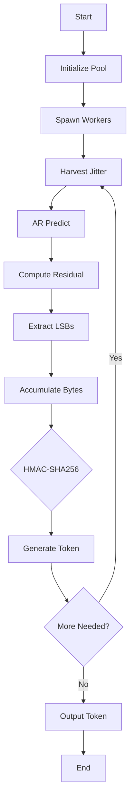
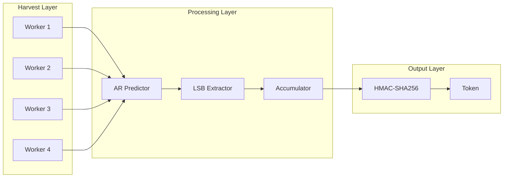

# Architecture Diagrams

## System Overview

```mermaid
graph LR
    A[Hardware Jitter] --> B[Harvester Workers]
    B --> C[Sample Channel]
    C --> D[AR Predictor]
    D --> E[Residual Extractor]
    E --> F[LSB Sampling]
    F --> G[Entropy Accumulator]
    G --> H[HMAC-SHA256]
    H --> I[256-bit Token]
    J[Auto-Reseed] --> D
```

## Component Flow

```mermaid
flowchart TD
    Start[Start] --> Init[Initialize Pool]
    Init --> Spawn[Spawn Workers]
    Spawn --> Harvest[Harvest Jitter]
    Harvest --> Predict[AR Predict]
    Predict --> Residual[Compute Residual]
    Residual --> Extract[Extract LSBs]
    Extract --> Accumulate[Accumulate Bytes]
    Accumulate --> Whitening{HMAC-SHA256}
    Whitening --> Token[Generate Token]
    Token --> Check{More Needed?}
    Check -->|Yes| Harvest
    Check -->|No| Output[Output Token]
    Output --> End[End]
```

## Data Pipeline

```mermaid
flowchart LR
    subgraph "Harvest Layer"
        W1[Worker 1]
        W2[Worker 2]
        W3[Worker 3]
        W4[Worker 4]
    end
    
    subgraph "Processing Layer"
        AR[AR Predictor]
        LSB[LSB Extractor]
        Acc[Accumulator]
    end
    
    subgraph "Output Layer"
        HMAC[HMAC-SHA256]
        Token[Token]
    end
    
    W1 --> AR
    W2 --> AR
    W3 --> AR
    W4 --> AR
    AR --> LSB
    LSB --> Acc
    Acc --> HMAC
    HMAC --> Token
```
